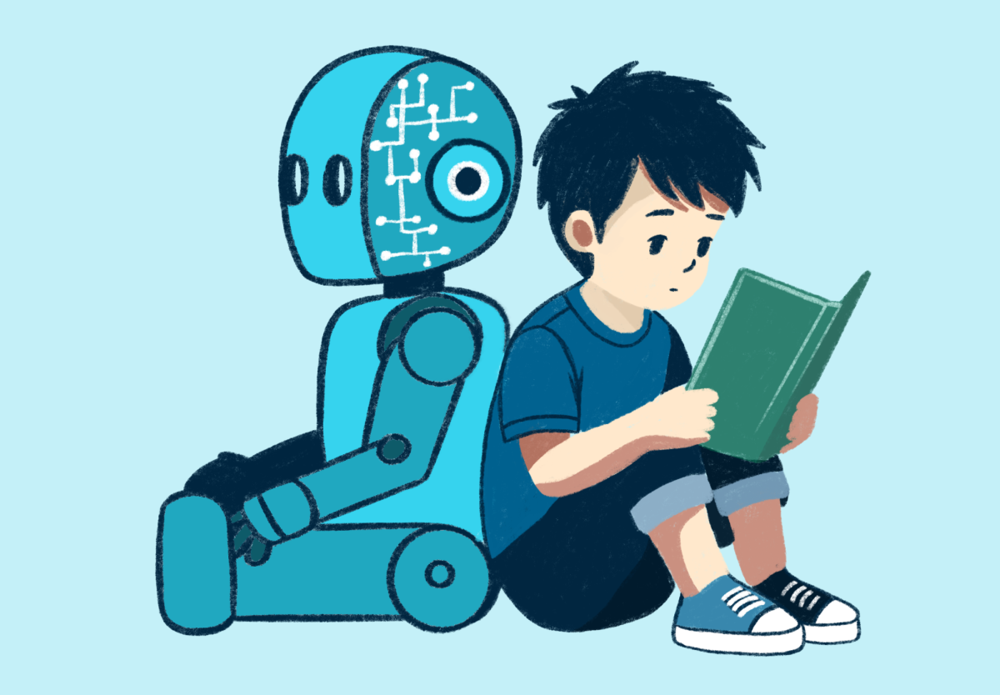

## I. Introduction

  As Artificial Intelligence (AI) continues to advance, it has introduced a new and arguably easier way to personalize learning and research. It allows users to ask specific questions while receiving responses that can be concise and easier to understand. Besides education, it has revolutionized numerous working fields, including Software Engineering, where it can identify possible errors, generate code, and assist with managing and optimizing projects. In my first Software Engineering class, I have used a few AI tools to help me with numerous assignments, from homework to projects. This includes ChatGPT and Deepseek. 

## II. Persoanl Experience with AI

### 1. Experience WODs e.g. E18

For WOD experiences specifically, I primarily did not use AI and completed them independently. However, there would be a few occasions where I had minor issues, and once I saw the answer, I wanted an explanation why the professor’s solution worked and why what I wrote had errors. 

2. In-class Practice WODs

In-class Practice WODs were quite challenging for me. I recall using AI, specifically ChatGPT, often because although my code would get a similar result to what I wanted, it would often have errors. In addition to this, when we reviewed how to solve the practice WOD, it would be relatively quick, so I would ask ChatGPT questions like “How can I adjust the text to look more like this?” or “Why is this certain section having errors?”. 

3. In-class WODs 

In-class WODs were almost equally as challenging as the Practice WODs, if not harder. Since this was a pass-or-fail type of assignment, I would often use AI to ensure that my code worked and for assistance when I was confused. 

4. Essays

I rarely found myself using AI when it came to essays. The only time I used AI was mainly to check for grammar mistakes by using Grammarly.  

5. Final project

For the final project, I used AI quite often when it came to writing and explaining code, since it was a group project. I often asked what a specific portion of the code does or how I can fix this so that it looks like how I want it. 

6. Learning a concept/tutorial

Learning new concepts was sometimes confusing, so I would refer to AI a few times. However, I would mainly refer to websites like GeeksforGeeks and W3Schools before referring to AI, since they are also good references. 

7. Answering a question in class or in Discord

I never used AI for answering questions in class or in Discord because I rarely answered any questions. 

8. Asking or answering a smart-question

I never used AI to ask or answer advanced questions, especially on the Discord channel, because I didn’t engage in those types of discussions.

9. Coding example e.g. “give an example of using Underscore .pluck”

When it came to coding examples, AI would be quite useful. The examples they provided were simple and easy to understand.

10. Explaining code

During the final project, it was a group project, so I would occasionally ask ChatGPT and Deepseek what this code does or how it works, especially when it comes to the database. 

11. Writing code

As mentioned before, I used AI to assist me in writing code in numerous assignments, like the WODs and the final project. 

12. Documenting code

In this specific class, documenting code was not something we did often. However, outside of this class, I used to rarely use AI. There were very few moments when I found it hard to explain my code in both a short and concise way. 

13. Quality assurance

This is how most of my questions would look when I had issues with my code. It was very helpful since it was specific to my problems, and it explained why it works while explaining the issues with my code. 

14. Other uses in ICS 314 not listed

One way that I used ChatGPT that was not listed was coming up with different ideas and titles for the group project. 

## III. Impact on Learning and Understanding:

The incorporation of AI has influenced my learning experience in both positive and negative ways. In terms of positivity, I have been able to get a better understanding of software engineering topics. It caters to my specific questions and provides explanations that would otherwise be hard to find or understand. However, I have found myself to heavily on AI, especially when it comes to programming, to the point where I have struggled with problem solving. I find myself referring to AI too easily, rather than committing to solving it by myself or researching more on the problem. 

## IV. Practical Applications:

Outside of ICS 314 and software engineering in general, AI can be a useful tool for students to learn certain topics that may be challenging. For one, I used AI to help me better understand Calculus and Physics. I also find AI helpful when it comes to writing, especially when it comes to emails, to ensure that it sounds professional and my message is clear.

## V. Challenges and Opportunities:

In terms of limitations, there were certain assignments that had numerous files. Since a lot of files were involved, this made it difficult for ChatGPT to correctly identify what I needed. This is when ChatGPT becomes more of a tool for learning rather than cheating. Assignments like this can encourage students to ask smart questions to help them rather than heavily relying upon it to give them the code. 

## VI. Comparative Analysis:

I find both traditional and AI-enhanced approaches of teaching effective. In-person teaching opens to challenges, and being able to learn not only about the subject, but human interaction, like communication skills. However, AI can give advice that may be easier to understand. Both can be implemented to work and complement each other rather than one replacing the other. 

## VII. Future Considerations:

I believe that the role of AI in software engineering education will continue to advance no matter what. With a topic like software engineering, there is a vast amount of information and knowledge that students must learn, memorize, and incorporate into their projects. AI has the potential to help expand their knowledge and assist them with what would otherwise be confusing. However, it is not a secret that it may also negatively affect students, as it is very easy to simply get the answer instead of learning or understanding the purpose of what AI may have to offer. Simply copying and pasting information doesn’t improve problem-solving skills, so a balance of the tool is still in need of improvement. 

## VIII. Conclusion:

AI has become a powerful tool in software engineering for students to take advantage of, offering support, guidance, and personalized learning experiences. However, it can also do the opposite if not used properly, removing the learning aspect and preventing room for growth. With this in mind, there is a need for a balance where AI is more of an assistant while leaving room for independent learning. 

