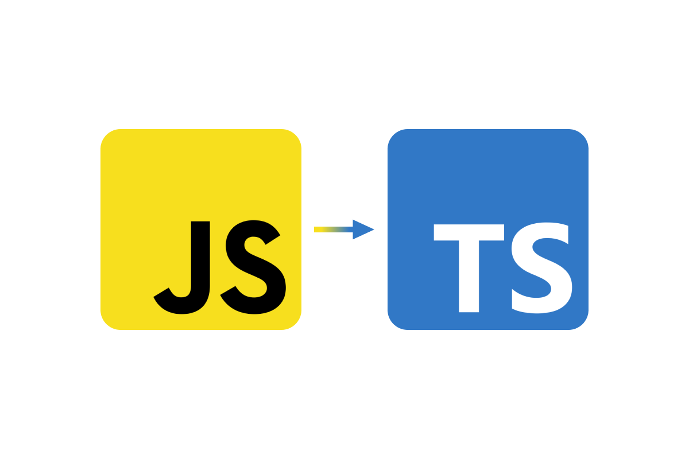

My interest in software engineering stems from the ability to tackle problems and developing software. Despite how challenging and frustrating the maintenance side sounds-having to constantly make updates and fixing bugs-it also sounds like something I could enjoy. I like being able to problem solve and learn new techniques to make things more efficient. I find it fulfilling when I am able to implement what I have learned to solve a problem and see it work successfully. 

In the near future, I aim to enhance my programming and problem solving skills as it is essential for not only a software engineer, but in the ICS field as a whole. I am still in the process of learning how to program professionally, but I hope that I grow to become more confident in my programming skills. I also intend to try to improve my communication skills and convey my thoughts better as I still have trouble being able to speak up and explain in a way that others understand. I believe that these skills will allow me to become a better programmer and a good future colleague. 

Ultimately, my goal is to find a job that best suits me and is something that I am able to enjoy. By learning more about software engineering, I will get a better grasp and understanding of what I want to do in the future since my interest in software engineering is based mostly on speculation of what I think I will enjoy doing. If this is something that I wish to further pursue, I hope that I become an experienced software engineer that is confident in my abilities and is capable of helping the company or organization that I am a part of. 
