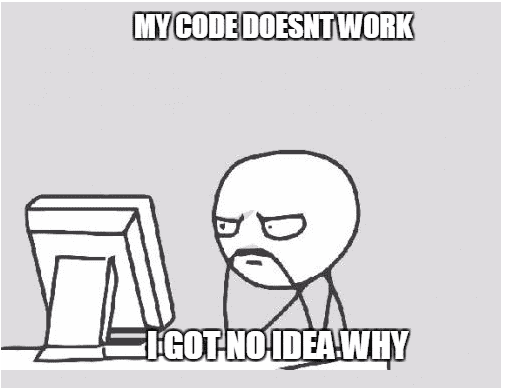

## Should You Really Ask That?

Occasionally, there will be that one student who asks the teacher the most obvious questions. The teacher’s or professor’s reaction varies from a polite to a sarcastic or dismissive response. This scenario likely stems from the fact that many teachers promote the idea of asking questions regardless of how insightful they are because “there are no dumb questions” or “it’s better to ask questions rather than being clueless the entire time”. However, in this day of age, we have access to endless resources thanks to web browsers like Google and AI chatbots like ChatGPT that can answer basic questions in an instant. When asking a question, there are proper ways to formulate them so that they are sophisticated and technical enough to gain attention and receive an intellectual response. 

## Think Before You Ask.

Stack Overflow is viewed as a collection of knowledge. It’s a website where computer programmers are meant to ask and respond to questions or problems that not only help the questioner but those who may face similar problems. Questions and how they are asked must be formulated in a way that makes experienced users want to answer them. 

An example of what experienced users are looking for would be the following. This user is asking how to sort a map descending by values and then alphabetically by keys. 

```
Q: How could we sort a Map descending by values and then alphabetically by keys?

To participate in a prize draw each one gives his/her firstname.Each letter of a firstname has a value which is its rank in the English alphabet. A and a have rank 1, B and b rank 2 and so on. The length of the firstname is added to the sum of these ranks hence a number som.An array of random weights is linked to the firstnames and each som is multiplied by its corresponding weight to get what they call a winning number.

Example:
names: "COLIN,AMANDBA,AMANDAB,CAROL,PauL,JOSEPH" weights: [1, 4, 4, 5, 2, 1]
PauL -> som = length of firstname + 16 + 1 + 21 + 12 = 4 + 50 -> 54 The weight associated with PauL is 2 so PauL's winning number is 54 * 2 = 108.

Now one can sort the firstnames in decreasing order of the winning numbers. When two people have the same winning number sort them alphabetically by their firstnames. Task:

parameters: st a string of firstnames, we an array of weights, n a rank
return: the firstname of the participant whose rank is n (ranks are numbered from 1)

Example:
names: "COLIN,AMANDBA,AMANDAB,CAROL,PauL,JOSEPH" weights: [1, 4, 4, 5, 2, 1] n: 4

The function should return: "PauL"

When input is:
Names: William,Willaim,Olivia,Olivai,Lily,Lyli weights: [1, 1, 1, 1, 1, 1] n: 1
Expected is:
Willaim
But the code outputs:
William
So, as we see, first I sort the map by values in descending order. Then I thought if I get the keys and I sort them alphabetically, it would just take care of the ones with exact same values; however it sorts all. How could we sort a Map descending by values and then alphabetically by keys‽‽‽

I have also read:

Sort a Map<Key, Value> by values
What's the simplest way to print a Java array?
Sort an array in Java
Why doesn't java.util.Set have get(int index)?
Printing Java Collections Nicely (toString Doesn't Return Pretty Output)
Method to extract all keys from LinkedHashMap into a List
How get value from LinkedHashMap based on index not on key?
Sort a Map<Key, Value> by values
How do I efficiently iterate over each entry in a Java Map?
```
Although there is some room for improvement, this is a solid question. This individual describes the situation they are in quite well. They introduce what they are trying to achieve and go through expected and actual results, giving people a better understanding of the possible issue. As they go through everything, one key thing that they do well is that they put in effort to solve the problem by themselves before asking. As a result of this, they were able to get two responses; one explaining which built-in methods to use instead and one showing a different way of sorting. This is overall a well-made question. 


## What Not To Do

Although simple questions on how to do something could still be useful to other users, it is important to understand who or where you are asking this. A website like StackOverflow isn’t a place for people to get answers to their homework. In the following example, a user was asking how to delete minimum and maximum from an array. 

```
Q: [How to delete minimum and maximum from array?](https://stackoverflow.com/questions/74168347/how-to-delete-minimum-and-maximum-from-array)


I'm a newbie in java. I'm trying to find minimum maximum element in array and then delete the minimum and maximum. This is the code I wrote, it's only working for maximum not for minimum.

```

The first impression of this question is not the best. There are spelling errors and rather than explaining what in detail, they simply explain the problem they are having and post their code. Based on that, it doesn’t show that they put in any attempt to try to figure out the problem themselves and were even downvoted as a result. This user should either attempt or prove that they have attempted to solve the problem before asking for help on a place like StackOverflow. 

## Conclusion

Asking questions is crucial to understanding a topic and expanding one’s knowledge. However, when we ask someone for their expertise, it is important to consider how that question can be beneficial to not only us but others as well and that it’s formatted in a way that makes the person want to answer the question. So, the next time you ask a question, make it a worthwhile one. 
