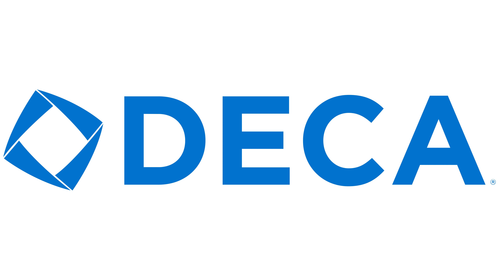

During junior year, I was a part of DECA, a business club that gave students the opportunity to compete in a competition with other schools in different business categories called CTSO. We were either competing in pairs or individually and given a category that would best suit us. Part of the competition required us to give a solution to a problem related to our category through a short presentation and would have judges that would ask us questions and determine whether or not we successfully accomplished our task. There was also a written test that would separately take place. 

When I competed, I was fortunate enough to get partnered up with a friend of mine and we were assigned with marketing. The issue was that both me and my friend never took the marketing class. I enjoyed the classes involving finance and accounting while he took classes involving economics. To prepare for the competition, we had someone who had won their category in a previous year mentor us. Based on how we presented, she would give us valuable advice and strategies we could use that helped her. We also had to prepare for the written test by taking practice tests quite frequently after-school. The day of the competition was nerve-racking since I have never been a good public speaker but we ended up being finalists.

I found the experience well worth it as it gave me the opportunity to go beyond my comfort zone. I had to manage my time wisely by balancing both my homework and practice sessions to prepare for CTSO. It also required me to communicate well with my partner to plan out the best proposition to our judge the best we could within the short time period. In addition to all of this, I had to present confidently and was forced to think of solutions to problems on the spot. Overall, it taught me a lot about what a work environment is like and prepared me for my job at the YMCA. 

