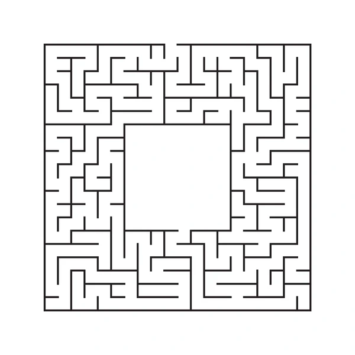

The last AP Computer Science project my class was assigned was to create a mousebot. We each created an algorithm that would determine how our mousebot will traverse around an area that had similar characteristics to a maze. Each mouse had stamina that would lower each time it moved. Once the stamina reached to 0, it would die. To prevent this, there was cheese around the maze that would help regain it's stamina. The goal was to survive the longest while up against other students using the functions provided by our teacher. 

From this experience, I learned about the challenges of having to deal with problems that aren’t fixed or set. I had to consider different strategies to not only out-think my fellow classmates, but to also consider the best possible paths to survive the longest. This also taught me how flexible programming is. There’s more than one way to accomplish something that could be more efficient. 
