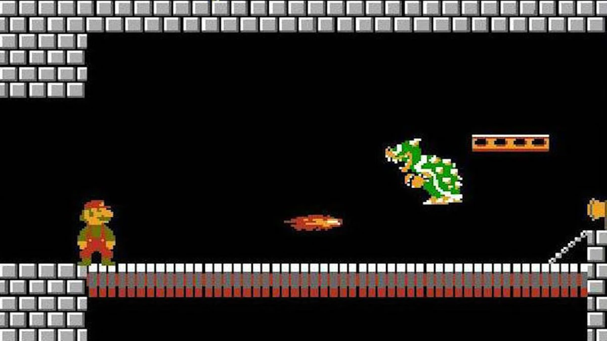

The game we were assigned to make was supposed to be modeled after Dungeon and Dragons. We would create both the player’s character and the enemies, assigning them stats (HP, Strength, and Defense) that would be randomly generated. When the player would face the enemy, the attack had to also be randomly generated based on the strength and defense stats. We were also able to get creative as to how we could make the games more challenging or unique. 

My RPG project used characters from Mario. I made Goombas, Koopa Troopas, and Dry Bones as the first few enemies that the player would face with Bowser being the final boss. I also added power ups like the Super Mushroom and the Fire Flower that the player could randomly obtain after defeating an enemy that would raise a specific stat. 

While doing this project, I remember having to talk with my tablemates quite often because we all had issues with our projects. We would work together to help solve the bugs we had in our programs which taught me both problem solving and communication skills. It also made me realize the challenges of explaining your ideas in a way for someone else to understand. 
